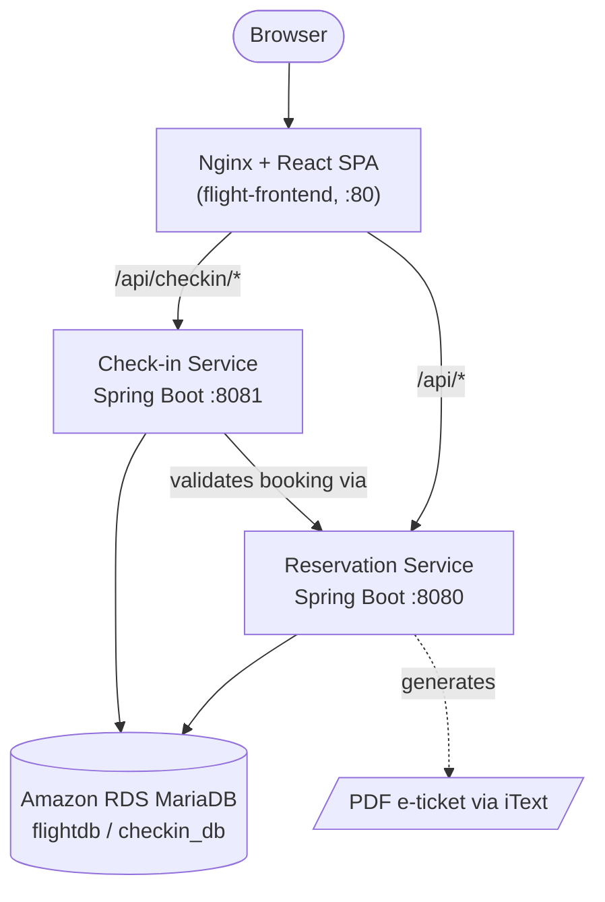
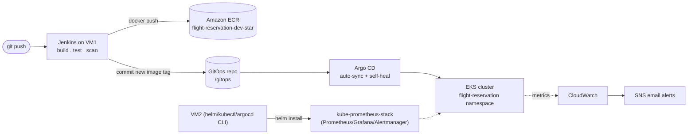

# ✈️ Flight Reservation Application — AWS/EKS Edition

A full-stack flight reservation and check-in platform, built as a microservices system and shipped to production with an end-to-end DevOps pipeline: Terraform-provisioned AWS infrastructure, Jenkins CI, Docker, GitOps with Argo CD on EKS, RDS/S3/ECR, CloudWatch + SNS alerting, and Prometheus/Grafana monitoring.

This is the AWS port of the original Azure/AKS build. Application source, UI, and business logic are unchanged — only the infrastructure, container registry, database, and deployment configuration were adapted for AWS. See [`flight-reservation-app-Azure`](https://github.com/AnuragPatil-cloud/flight-reservation-app-Azure) for the Azure edition this was ported from.

<p align="center">
  
</p>

<p align="center">
  
  
  
  
  
  
  
  
  
  
</p>

---

## Table of contents

- [Overview](#overview)
- [Features](#features)
- [Application screenshots](#application-screenshots)
- [Architecture](#architecture)
- [Tech stack](#tech-stack)
- [Repository layout](#repository-layout)
- [API reference](#api-reference)
- [Infrastructure (Terraform)](#infrastructure-terraform)
- [CI/CD pipeline (Jenkins + ECR)](#cicd-pipeline-jenkins--ecr)
- [GitOps deployment (Argo CD + EKS)](#gitops-deployment-argo-cd--eks)
- [Monitoring](#monitoring)
- [Getting started locally](#getting-started-locally)
- [Deploying to AWS](#deploying-to-aws)
- [Security notes](#security-notes)
- [Roadmap](#roadmap)
- [Author](#author)

---

## Overview

This project is a **flight booking and check-in system** split into three independently deployable services — a React SPA, a reservation backend, and a check-in backend — backed by a shared MariaDB database (run as **Amazon RDS** in this edition, not as a pod). It doubles as a reference implementation of a **production-style AWS DevOps pipeline**: infrastructure as code, containerized builds, automated testing, GitOps-driven continuous delivery, and cluster observability.

Everything from provisioning the AWS VPC to promoting a new container image into the running EKS cluster is automated.

## Features

**Traveller-facing**
- Register / log in with JWT-based authentication
- Search flights by origin, destination, and date
- Book a flight and view a personal booking list
- Download a generated PDF e-ticket for a booking
- Self-service profile view and update
- Online check-in with baggage count, decoupled into its own service

**Admin-facing**
- Admin login (separate authentication guard from traveller login)
- Create, update, and delete flights
- View the full flight list and the list of registered admins
- Add additional admin accounts

**Platform**
- Stateless JWT auth shared across two independent Spring Boot services
- Nginx-based single-origin routing so the SPA never deals with CORS
- Fully automated build → scan → image → deploy pipeline
- Self-healing, auto-synced GitOps deployment
- CloudWatch alarms + SNS email alerting on EC2/RDS metrics, baked into the infrastructure code

## Application screenshots

| Home | Login | Register |
|---|---|---|
|  |  |  |

| Search flights | Profile | Contact |
|---|---|---|
|  |  |  |

> Pipeline/infrastructure screenshots (Jenkins, Argo CD, CLI output) in `FRA-SCREENSHOTS/` are from the original Azure/AKS build and are being replaced with AWS/EKS equivalents as the migration is completed.

## Architecture



The frontend is served by **Nginx on port 80** and acts as the single origin for the browser. It reverse-proxies:

- `/api/checkin/*` → `flight-checkin-service:8081`
- `/api/*` → `flight-reservation-service:8080`
- everything else → the React static build (SPA fallback)

This means the UI never needs to know the backend service addresses at runtime — only Nginx does — which keeps the two backend services free to move, scale, or restart independently.

### Delivery pipeline



## Tech stack

| Layer | Technology |
|---|---|
| Frontend | React 19, Vite 6, React Router 7, Redux Toolkit, Axios, React Toastify, Boxicons |
| Reservation service | Java 17, Spring Boot 3.3.5, Spring Security, Spring Data JPA, JJWT, iTextPDF |
| Check-in service | Java 17, Spring Boot 3.3.5, Spring Security, Spring Data JPA, JJWT |
| Database | Amazon RDS MariaDB 10.11 (two logical schemas: `flightdb`, `checkin_db`) |
| Containers | Docker, Nginx (frontend static/reverse proxy), Eclipse Temurin JRE (backend) |
| Infrastructure as Code | Terraform (modular: vpc, security-groups, iam, ec2-jenkins, ec2-monitoring, eks, rds, s3, ecr, sns, cloudwatch) — kept in a separate repo/folder, not part of this package |
| Cloud | Amazon Web Services (VPC, EC2, EKS, RDS, S3, ECR, CloudWatch, SNS) |
| CI | Jenkins (self-hosted on an EC2 VM), SonarQube |
| CD / GitOps | Argo CD (auto-sync, self-heal, prune) |
| Orchestration | Amazon EKS, Kustomize-style manifests |
| Monitoring | kube-prometheus-stack (Prometheus, Grafana, Alertmanager) via Helm |

## Repository layout

```
flight-reservation-app-AWS/
├── frontend/                      # React + Vite SPA, Nginx Dockerfile
├── FlightReservationApplication/  # Spring Boot: users, flights, bookings, PDF tickets
├── FlightCheckInApplication/      # Spring Boot: check-in workflow
├── gitops/                        # Kubernetes manifests (Kustomize), synced by Argo CD
├── argocd-application.yaml        # Argo CD Application definition
├── monitoring/                    # kube-prometheus-stack values + setup notes
├── docs/                          # Jenkins credentials setup notes
├── FRA-SCREENSHOTS/               # Screenshots used in this README
├── Jenkinsfile                    # Root CI/CD pipeline (builds, pushes to ECR)
├── .gitignore
└── README-DEPLOYMENT.md           # Detailed one-time deployment runbook

# terraform/ lives separately - see the AWS DevOps runbook for its module layout
# (vpc, security-groups, iam, ec2-jenkins, ec2-monitoring, eks, rds, s3, ecr, sns, cloudwatch).
```

## API reference

### User service — `/api/users` (Reservation app)

| Method | Endpoint | Description |
|---|---|---|
| POST | `/register` | Register a new user |
| POST | `/login` | Authenticate and receive a JWT |
| GET | `/{id}` | Fetch a user by ID |
| GET | `/userList` | List all registered users |
| PUT | `/update/{id}` | Update a user's profile |

### Flight service — `/api/flights` (Reservation app)

| Method | Endpoint | Description |
|---|---|---|
| POST | `/create` | Add a new flight (admin) |
| GET | `/all` | List all flights |
| GET | `/search` | Search flights by origin, destination, date |
| PUT | `/update/{id}` | Update a flight (admin) |
| DELETE | `/delete/{id}` | Remove a flight (admin) |

### Booking service — `/api/bookings` (Reservation app)

| Method | Endpoint | Description |
|---|---|---|
| POST | `/book` | Create a booking |
| GET | `/user/{userId}` | List a user's bookings |
| GET | `/details/{bookingId}` | Get a single booking's details |
| GET | `/download-ticket/{bookingId}` | Download the e-ticket as a generated PDF |

### Check-in service — `/api/checkin` (Check-in app)

| Method | Endpoint | Description |
|---|---|---|
| POST | `/{bookingId}` | Check in a booking (`numberOfBags` param, JWT bearer token); the service validates the booking against the reservation service before completing check-in |

## Infrastructure (Terraform)

Terraform is **not included in this package** — per the AWS DevOps runbook, it's provisioned from its own modular stack:

| Module | Provisions |
|---|---|
| `vpc` | VPC, public/private/database subnets across two AZs |
| `security-groups` | Security groups for the VMs, EKS, and RDS |
| `iam` | Instance roles (ECR push/pull, CloudWatch, EKS admin) |
| `ec2-jenkins` | VM1 (`flight-reservation-dev-jenkins`) — Jenkins, Docker, SonarQube, Git, Maven, AWS CLI |
| `ec2-monitoring` | VM2 (`flight-reservation-dev-monitoring`) — kubectl, Helm, Argo CD CLI, AWS CLI |
| `eks` | The EKS cluster (`flight-reservation-dev-eks`), two `c7i-flex.large` nodes |
| `rds` | Private MariaDB instance (`flight-reservation-dev-rds`), not publicly accessible |
| `s3` | Bucket for important application files |
| `ecr` | Three repositories: `flight-reservation-dev-reservation`, `flight-reservation-dev-checkin`, `flight-reservation-dev-frontend` |
| `sns` | SNS topic + email subscription for alerts |
| `cloudwatch` | Alarms for Jenkins/Monitoring VM CPU and RDS CPU/storage |

Applying the stack requires a `terraform.tfvars` with your AWS region, key pair, admin CIDR, and RDS/Grafana passwords — see the runbook for the full variable list and naming convention.

## CI/CD pipeline (Jenkins + ECR)

The root [`Jenkinsfile`](./Jenkinsfile) runs on the Terraform-provisioned Jenkins VM (VM1) and drives every merge to `main` through seven stages:

1. **Checkout** — pull the repository
2. **Backend Build** — spin up an ephemeral MySQL container, run `mvn clean verify` against the reservation service (unit + integration tests) and package the check-in service
3. **Frontend Checks** — `npm ci`, ESLint (non-blocking), and a production Vite build
4. **SonarQube Analysis** — static analysis and quality-gate reporting
5. **Docker Build** — build images for all three services, tagged for ECR
6. **Push Images to ECR** — `aws ecr get-login-password` (using the VM1 instance role, no stored AWS keys), then push immutable build-numbered tags and `latest`
7. **Update GitOps** — patch the image tags into `gitops/*-deployment.yaml` and push the commit back to `main` (`[skip ci]`)
8. **Post Actions** — clean up the ephemeral database container and dangling images

Required Jenkins credentials are documented in [`docs/JENKINS-CREDENTIALS.md`](./docs/JENKINS-CREDENTIALS.md):

- `sonarqube-token` — SonarQube token
- `github` — GitHub credentials with push access to `main` (so the GitOps stage can commit)
- AWS auth is via the **VM1 instance IAM role** — no AWS keys stored in Jenkins

## GitOps deployment (Argo CD + EKS)

The `gitops/` directory is a Kustomize-style manifest set — namespace, a ConfigMap (RDS connection strings, service URLs), the two Spring Boot Deployments/Services, and the frontend Deployment/Service — all in the `flight-reservation` namespace. MariaDB is **not** deployed as a pod in this edition; the app connects to the private RDS instance instead.

[`argocd-application.yaml`](./argocd-application.yaml) points Argo CD at that folder on `main` with **automated sync, self-heal, and prune** enabled, so any commit that lands on `main` (including the Jenkins image-tag bump) is reconciled onto the cluster within seconds, and any manual `kubectl` drift is reverted automatically.

```bash
kubectl apply -f argocd-application.yaml
argocd app get flight-reservation
argocd app sync flight-reservation
```

## Monitoring

VM2 (kubectl, Helm, Argo CD CLI) is used to install **kube-prometheus-stack** *inside* the EKS cluster, rather than running Prometheus/Grafana on the VM itself — keeping the VM a thin control point and the metrics pipeline part of the same GitOps-managed cluster:

```bash
helm repo add prometheus-community https://prometheus-community.github.io/helm-charts
helm repo update
kubectl create namespace monitoring --dry-run=client -o yaml | kubectl apply -f -
helm upgrade --install kube-prometheus-stack prometheus-community/kube-prometheus-stack \
  --namespace monitoring \
  --values monitoring/kube-prometheus-stack-values.yaml
```

AWS-side infrastructure (EC2, RDS) is watched separately by **CloudWatch alarms**, which notify an **SNS** topic by email. Application-level metrics can be added later by enabling the Spring Boot Actuator/Micrometer endpoints and pointing a `ServiceMonitor` at them.

## Getting started locally

**Prerequisites:** Java 17, Node.js 20+, Maven, and a local MySQL/MariaDB instance.

1. **Clone the repo**
   ```bash
   git clone https://github.com/AnuragPatil-cloud/flight-reservation-app-AWS.git
   cd flight-reservation-app-AWS
   ```

2. **Reservation service** — override the datasource via environment variables (defaults to `localhost`), then:
   ```bash
   cd FlightReservationApplication
   ./mvnw spring-boot:run   # serves on :8080
   ```

3. **Check-in service** — same idea, then:
   ```bash
   cd FlightCheckInApplication
   ./mvnw spring-boot:run   # serves on :8081
   ```

4. **Frontend**
   ```bash
   cd frontend
   npm install
   VITE_API_URL=http://localhost:8080 VITE_API_CHECKIN_URL=http://localhost:8081 npm run dev
   ```
   The Vite dev server runs on `:5173` by default and talks directly to both backend ports.

For a production-like run, build and run the three Docker images (`frontend`, `FlightReservationApplication`, `FlightCheckInApplication`) behind the provided `frontend/nginx.conf`, which is what the EKS deployment does.

## Deploying to AWS

The full one-time setup follows the AWS DevOps runbook's 18 phases. In short:

1. `terraform apply` the (separate) Terraform stack to create the VPC, VM1, VM2, EKS cluster, RDS, S3, ECR, SNS, and CloudWatch alarms.
2. Provision Jenkins on VM1 and add the credentials listed above (no AWS keys needed — use the instance role).
3. Fill in `gitops/configmap.yaml` with the real RDS endpoint and frontend URL, and create `gitops/secret.yaml` from `gitops/secret.example.yaml` with the real RDS credentials (never commit the real file — it's gitignored).
4. Point `argocd-application.yaml` at your fork/repo (already set to this repo) and `kubectl apply` it, then `kubectl apply -f gitops/secret.yaml` once.
5. Push to `main` — Jenkins builds, pushes images to ECR, and updates the GitOps manifests; Argo CD takes it from there.
6. Install kube-prometheus-stack from VM2 and confirm the SNS email subscription.

## Security notes

- `gitops/secret.example.yaml` ships with a `CHANGE_ME_STRONG_PASSWORD` placeholder. Copy it to `gitops/secret.yaml`, fill in the real RDS credentials, and never commit that file (it's covered by `.gitignore`).
- The `application.properties` files under each Spring Boot service take their datasource URL/username/password entirely from environment variables (`SPRING_DATASOURCE_URL`, `SPRING_DATASOURCE_USERNAME`, `SPRING_DATASOURCE_PASSWORD`) with only local-dev defaults committed — no live credentials or endpoints are checked into this repository.
- AWS access keys are never stored in Jenkins, `terraform.tfvars`, or Git — ECR auth uses the VM1 instance IAM role, per the runbook's credentials rule.
- The `FRA-SCREENSHOTS/` images include a demo profile page with sample personal details used purely for testing — swap it for a screenshot with placeholder data if you plan to publish this repository publicly.

## Roadmap

Ideas for extending this project further:
- Add a `docker-compose.yml` for a one-command local stack (frontend + both services + MariaDB)
- Wire up Spring Boot Actuator/Micrometer so Prometheus can scrape real application metrics, not just cluster metrics
- Add automated frontend tests to the Jenkins pipeline (Testing Library is already a dependency)
- Introduce a staging environment/namespace ahead of `main` in the GitOps flow
- Move the RDS endpoint/frontend URL out of `gitops/configmap.yaml` and into Terraform outputs consumed by CI, so nothing needs manual editing after `terraform apply`

## Author

**Anurag Patil** — DevOps Engineer
GitHub: [AnuragPatil-cloud](https://github.com/AnuragPatil-cloud)

---

*No license file is currently included — add one (MIT, Apache-2.0, etc.) if you intend to open-source this repository.*
